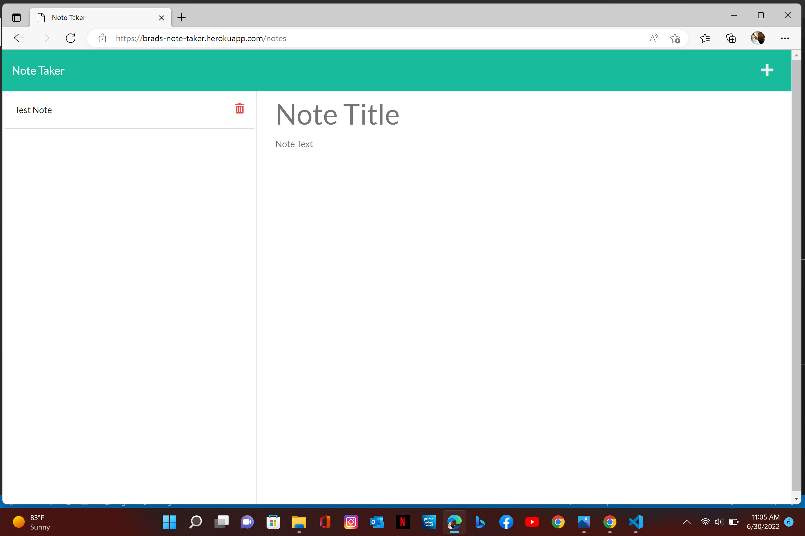

  # Note Taker

  * 
  
  ## License 

   * Licensed by [ISC License](https://choosealicense.com/licenses/isc/)

  ## Links to Application
  -[Visit Note Taker](https://brads-note-taker.herokuapp.com/)

  -[Visit Repository](https://github.com/Codechef27/note-taker)

  ## Table of Contents

  - [Description](#description)
  - [Installation](#install-instructions)
  - [Languages](#languages-used)
  - [Usage](#usage)
  - [Contribution](#contributing)
  - [Test](#test)
  - [Questions](#questions)

  ## Description

  This app is designed for a user to create and delete notes, to stay organized.

  ## Languages Used

  HTML,CSS,Javascript,Other

  ## Usage 

    Simple layout, just click the get started button on the landing page. Add a title for your note then add a description for your note, click the save button. Also, click the trashcan icon to delete the note.

  ## Install Instructions

  Visit the heroku link provided  and bookmark the application.

  ## Tests

  

  ## Contributing

  Bradley Kennett

  ## Questions

  Contact Me!

  * Github Account:  [Codechef27](https://github.com/Codechef27)
  * Email Me:  bradleyjkennett@gmail.com

  ## Screenshots
  
  
